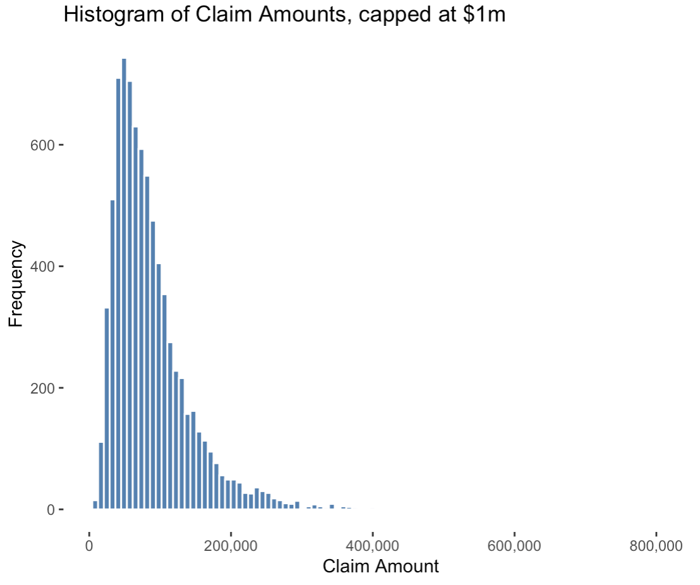
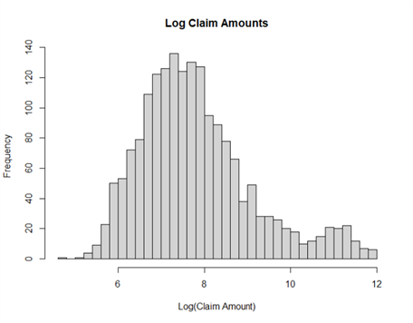
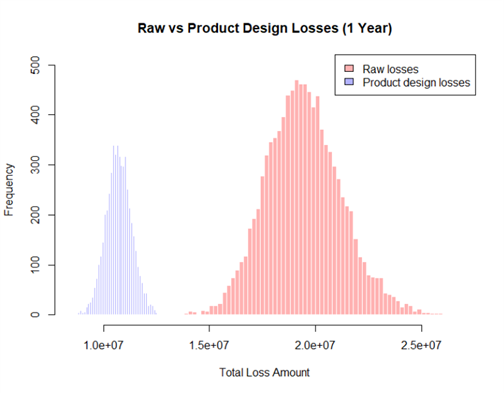

# SOA Case Study 2026: Actuaries in Space

### Project Team
Michelle Chen, Ianish Ketaruth, Ellen Lim, Alec Peng, Swetha Ramesh

## Project Outline

This project was completed as part of the 2026 SOA Research Institute Student Research Case Study Challenge. Our team developed insurance product recommendations for Cosmic Quarry Mining Corporation, a space mining company operating across three solar systems. Using historical claims data across four hazard areas including equipment failure, cargo loss, workers’ compensation, and business interruption, we applied actuarial modelling techniques to assess risk and estimate costs.

Our analysis focused on evaluating loss distributions and extreme scenarios to inform pricing and capital considerations. Based on these insights, we proposed tailored insurance product designs that account for the unique characteristics of each solar system. 

## Data Preparation

The primary datasets used in this analysis were provided in the Project Data section of the case study. These datasets included historical claims information for the hazard areas, macroeconomic data and prospective data. Qualitative data from the Online Encyclopedia Entries was also utilised to create assumptions for prospective data, based on risk hazards in each solar system. 

Significant data cleaning was required before modelling to ensure the datasets were suitable for statistical analysis. Data cleaning performed was the removal of negative values and missing claim information and the cleaning of data outside the ranges defined in the Data Dictionary. The missing claim information was removed to maintain data accuracy and sufficient data observations remain. Hence, through these procedures, we have ensured accurate, appropriate and reliable data is inputted into our models.  

See example code to ensure data is appropriate as per the Data Dictionary

``` r
cargo_freq_clean <- cargo_freq_clean %>%
  filter(
    cargo_value >= 50000 & cargo_value <= 680000000,
    weight >= 1500 & weight <= 250000,
    route_risk %in% c(1,2,3,4,5),
    distance >= 1 & distance <= 100,
    transit_duration >= 1 & transit_duration <= 60,
    pilot_experience >= 1 & pilot_experience <= 30,
    vessel_age >= 1 & vessel_age <= 50,
    solar_radiation >= 0 & solar_radiation <= 1,
    debris_density >= 0 & debris_density <= 1,
    exposure >= 0 & exposure <= 1,
    claim_count >= 0 & claim_count <= 5,
    claim_count == floor(claim_count)
  )
```

## Exploratory Data Analysis
To better understand the severity and frequency data from the datasets, exploratory data analysis was undertaken. In this step, we looked at summary statistics, histograms and plots. 

### Business Interruption

Figure 1: Business Interruption Claim Size Distribution


The above histogram shows that BI claims are highly right-skewed, with most losses small but a long tail of extreme claims driving the mean and overall insurer risk. Overall, this disparity demonstrates the need for appropriate product design in handling right-tail risk.

### Cargo Loss

Figure 2: Cargo Loss Claim Size Distribution (Log Scale)


The above histogram demonstrates the bimodal nature of cargo loss severity. This is due to a higher number of small or catastrophic cargo accidents. Hence, through this exploratory data analysis, we can better understand the nature of the cargo loss claims and therefore the best way to price them.

### Equipment Failure

Figure 3: Equipment Failure Claim Size Distribution



The distribution of simulated equipment failure losses displays a clear right-skewed shape, which is typical of insurance claims data. A gamma distribution was used to model severity, capturing the strictly positive and heavy-tailed nature of equipment failure costs. Most observations are concentrated at lower loss levels, with a long right tail reflecting infrequent but severe events. This behaviour is consistent with operational risk in high-stress mining environments, where extreme equipment breakdowns can lead to disproportionately large losses relative to the average claim.

### Workers Compensation

Figure 4: Workers Compensation Claim Size Distribution (Log Scale)



The workers compensation claim distribution is heavily right-skewed, with most claims concentrated at lower values and a long tail of severe incidents. The log-transformed distribution reveals the underlying structure more clearly, with a primary concentration of typical operational injuries and a smaller cluster of larger claims from severe accidents or high-salary workers. A Gamma GLM was used to model severity, capturing the strictly positive and right-skewed nature of the data, with per-claim caps applied in the product design to manage tail exposure.

## Modelling Approach and Methodology

We developed our modelling framework by first preparing historical claims data across all four hazard areas, ensuring consistency in both frequency and severity datasets. Using this cleaned data, we constructed Generalised Linear Models (GLMs) to capture the underlying relationships between risk drivers and claim outcomes.

To project future performance, we combined the GLM outputs with prospective exposure data provided in the RFP, allowing us to generate predictions of claim frequency and severity for Cosmic Quarry Mining Corporation’s operations. We then applied a stochastic simulation approach, running 10,000 simulations to model the aggregate loss distribution for each hazard area. This enabled us to quantify the expected losses, variability, and tail risk, providing a solid foundation for pricing and product design.

### Business Interruption

Claim frequency was modelled with a Negative Binomial GLM, with predictors including solar system, production load, energy backup score, supply chain index, crew experience, maintenance frequency and safety compliance. Severity was modelled with a Gamma GLM, with key drivers including solar system, production load, energy backup score and safety compliance. We simulated aggregate losses with Monte Carlo simulations, over 10,000 iterations and found the total premium is allocated proportionally by expected loss, with Helionis carrying the highest share.

At portfolio level, the probability of negative net revenue is 7.5%, with expected net revenue of $136.1M and 5th percentile of -$20.95M, indicating that losses are still manageable under adverse conditions (see Appendix Table BI-2). For short- and long-term projections, the present value of costs declines from $467M to $433.4M for Helionis over 10 years as the discount rate (5.10%) partially offsets inflation (4.23%), thus highlighting profitability over the full projection horizon.

Figure 5: Business Interruption Claims (Log-Transformed Distribution)


### Cargo Loss
For cargo loss frequency, a Poisson model was initially fit. However, after finding the dispersion coefficient of 4.506735, it was clear that the model was too dispersed to fit the data. Then a negative binomial was fit to cargo loss frequency. After testing the AIC, it was clear that the negative binomial model was a better fit for the dataset. Then, testing was performed to reduce the complexity of the model by removing insignificant and unnecessary predictors. AIC was also used to test the goodness of fit of the model, with results showing a reduced model was less complex and a better fit. 

For cargo loss severity, from the EDA above it was clear that severity was split into two distinct groups. After testing a Gamma model and the Pearson residuals, it was clear that Gamma was not a good fit for the data. 

Figure 6: Cargo Loss Claims by Commodity Type


After seeing the spread of claim amount by cargo type (see above image), the severity data was split depending on cargo group. Then two Gamma generalised linear models were fit to each dataset. After comparing the AIC after this change, it was determined that this was a better fit for the data. 

### Equipment Failure

Equipment failure risk was modelled using a frequency–severity framework. Claim frequency was estimated using a Poisson GLM with key predictors including equipment type, age, maintenance level, and usage intensity, while claim severity was modelled using a Gamma GLM driven primarily by equipment type, age, and usage. This structure captures the operational drivers of failure as well as the strictly positive, right-skewed nature of loss severity. The two components were combined through a 10,000-iteration Monte Carlo simulation, incorporating product features and underwriting constraints to generate full aggregate loss distributions for each solar system.

Results show expected losses are highest in the Helionis Cluster (~$20M), followed by Bayesia (~$6M) and Oryn Delta (~$2M), reflecting differences in asset volume, age, and operational intensity. Expected net revenue ranges from approximately $363k in Oryn Delta to $3.49M in Helionis, with Oryn Delta showing a higher probability of loss due to limited diversification and greater sensitivity to individual large claims. Stress testing indicates the model is more sensitive to severity than frequency, with losses increasing more sharply under severity shocks, while remaining within aggregate limits unless both frequency and severity increase simultaneously.

### Workers Compensation

Claim frequency was modelled using a Poisson GLM, with key predictors including occupation, accident history, psychological stress, gravity and safety training. Severity was modelled using a Gamma GLM, driven primarily by psychological stress and base salary. Gravity was found to significantly affect claim frequency but not severity, indicating that higher-gravity environments generate more claims rather than larger ones. Aggregate losses were simulated over 10,000 Monte Carlo iterations, incorporating the product benefit structure which reduces raw insurer losses by 44.8%.

Results show the highest per-worker cost in Bayesia ($322), followed by Helionis ($294) and Oryn Delta ($280), reflecting the influence of gravity on frequency. Expected net revenue ranges from approximately $308k in Oryn Delta to $970k in Helionis, with Oryn Delta showing the highest probability of loss at the system level due to its smaller workforce and reduced diversification. At portfolio level, the probability of negative net revenue drops to 0.2%, highlighting the diversification benefit of offering a single policy across all three systems.

Figure 7: Impact of Product Design on Total Losses



## Assumptions

Our modelling framework is built on a set of consistent financial and pricing assumptions applied across all hazard areas to ensure comparability and internal coherence. A 10th percentile excess was used as the attachment point for losses, reflecting a conservative threshold designed to focus coverage on more severe claim events while excluding high-frequency, low-severity losses. In addition, a per-claim cap at the 95th percentile of simulated losses and an aggregate annual cap at the 99.5th percentile were applied to limit extreme tail exposure while preserving meaningful risk differentiation across systems and coverages. This overall structure aligns with the tail-focused nature of interstellar mining risk and supports more stable pricing outcomes under extreme but plausible scenarios.

For pricing and financial calibration, a fixed risk loading of 10% and target profit margin of 5% were applied uniformly across all systems and coverages. Inflation and discount rate assumptions were taken directly from the prospective business data provided in the RFP, with an inflation rate of 4.23% and a discount rate of 5.1%. These were used to translate simulated losses into present-value terms and ensure pricing reflects both expected cost escalation and the time value of money in interplanetary operations.

In addition, product-specific underwriting assumptions were incorporated to better reflect operational controls and mitigate extreme risk exposures. For equipment failure, a minimum equipment maintenance standard was required; for business interruption, a minimum level of safety compliance was imposed; and for workers’ compensation, a salary cap was introduced to limit exposure to extreme payroll-driven claims.


## Key Results

Our key results summarise the financial outcomes of the modelling framework across each hazard area and solar system. Using stochastic simulation outputs, we estimated expected total losses and expected net revenue for equipment failure, cargo loss, workers’ compensation, and business interruption across the Helionis Cluster, Bayesia System, and Oryn Delta. These results reflect the interaction between system-specific risk profiles and the prospective exposure data, providing a consistent basis for comparison across regions and coverages.

### Expected Total Losses For Each Hazard Area

|Solar System|Business Interruption|Cargo|Equipment Failure|Workers Compensation|
|:---|:---|:---|:---|:---|
|Helionis Cluster|$470.9M|$16.7B|$20.5M|$5.7M|
|Bayesia System|$241.3M|$14.0B|$6.2M|$3.1M|
|Oryn Delta|$146.1M|$14.6B|$2.2M|$1.8M|

### Expected Net Revenue For Each Hazard Area

|Solar System|Business Interruption|Cargo|Equipment Failure|Workers Compensation|
|:---|:---|:---|:---|:---|
|Helionis Cluster|$79.5M|$3.6B|$3.5M|$970K|
|Bayesia System|$40.7M|$3.1B|$1.0M|$530K|
|Oryn Delta|$16.1M|$3.2B|$363K|$308K|

## Risk Assessment

Helionis Cluster presents a high level of operational volatility that most strongly impacts equipment failure and cargo loss risks. Frequent micro-collisions, shifting asteroid debris fields, and irregular gravitational resonances create a physically unstable mining and transport environment, increasing the likelihood of mechanical damage and disrupted supply chains. While its temperate and cold terrestrial mining sites are comparatively stable, the outer asteroid clusters dominate the overall risk profile due to rapid debris movement and periodic fragmentation events that also strain satellite relay infrastructure.

Bayesia System’s risk profile is primarily driven by workers’ compensation and equipment failure hazards, with secondary impacts on cargo integrity during radiation events. The binary star configuration produces intermittent spikes in radiation and particle emissions, accelerating equipment degradation and exposing personnel to elevated health and safety risks, particularly in the high-gravity mining environment. Although transport routes are relatively well-established and stable, these environmental extremes introduce periodic but severe disruption risks that must be accounted for in both workforce and asset protection modelling.

Oryn Delta is most significantly exposed to cargo loss and workers’ compensation risks, with growing relevance for equipment failure in expanding deep-extraction operations. The system’s low luminosity, communication limitations, and unstable gravitational conditions within the asymmetric asteroid ring create a challenging environment for safe navigation and reliable logistics. As operations extend into more hazardous outer regions, the combination of poor visibility, orbital shear zones, and delayed response capabilities increases both accident likelihood and the potential severity of operational losses.

## Recommendations
Based on the analysis of the data across the 4 business risks, we propose a suite of insurance products for Cosmic Quarry covering equipment failure, workers' compensation, and business interruption. Each product has been evaluated using three key criteria which include risk relevance, financial viability, and strategic value, to determine its suitability for inclusion in the portfolio. The key features of the products are outlined below:

### Business Interruption

- **Product:**
  - Covers mining revenue loss from disruptions (low frequency, high severity)
  - Mean claim ≈ $4.36M, right-skewed
- **Structure:**
  - Deductible: $462.8k (P10)
  - Per-claim cap: $15.2M (P95)
  - Aggregate cap: $1.105B (P99.5)
  - Reduces insurer losses by ~52%
- **Coverage:**
  - Trigger: material operational disruption
  - Covers lost revenue + fixed costs (wages, leases)
  - Events: supply chain shocks, extreme conditions
- **Exclusions:**
  - Planned downtime
  - Known/preventable risks
  - Poor operations
  - 5-day waiting period

### Equipment Failure

- **Product:**
  - Covers machinery breakdown risk in mining
  - High frequency (1–3 p.a.), low severity, right-skewed
  - Mean claim ≈ $89k (few > $1.5M)
- **Structure:**
  - Deductible: $34.7k (P10) → removes small/admin-heavy claims
  - Per-claim cap: $196k (P95)
  - Aggregate cap: $60M
- **Coverage:**
  - Trigger: equipment failure during normal operations
  - Covers repair/replacement costs
  - Excludes downtime (covered under BI)
- **Exclusions:**
  - Poor maintenance
  - Known defects
  - Wear & tear
  - Breach of manufacturer guidelines

### Workers Compensation

- **Product:**
  - Covers employee injury/illness risk
  - High frequency, low severity with right-skew
  - Severity highly variable (Gamma GLM)
- **Structure:**
  - Deductible: $555 per claim
  - Per-claim cap: $48.1k
  - Aggregate cap: $24M (P99.5)
- **Coverage:**
  - Trigger: work-related injury/illness causing > 5-day absence
  - Applies to employed workers (full-time/contract)
  - Filters out minor incidents (internalised)
- **Exclusions:**
  - Safety non-compliance
  - Undisclosed pre-existing conditions
  - Misconduct/negligence
  - Non-work activities
  - Non-specific psychological claims

### Cargo Loss

Cargo loss, while highly profitable, exhibits high volatility and a 25% probability of loss per system, with standard deviations exceeding mean returns. Due to this elevated tail risk, it should only be offered where significant reinsurance is in place to cover extreme losses.

### Portfolio Summary

Overall the proposed portfolio is balanced in terms of both risk and possible returns, with premiums set according to the conditions of each solar system. Equipment Failure and Workers' Compensation provide a stable, predictable earnings base due to their high-frequency, low-severity profiles, while Business Interruption adds value but requires more capital given its tail risk. To scale sustainably, growth should focus on diversifying exposures across systems to reduce correlation risk, optimising reinsurance to protect against large BI and cargo losses, and maintaining strict underwriting standards around safety and infrastructure quality.
